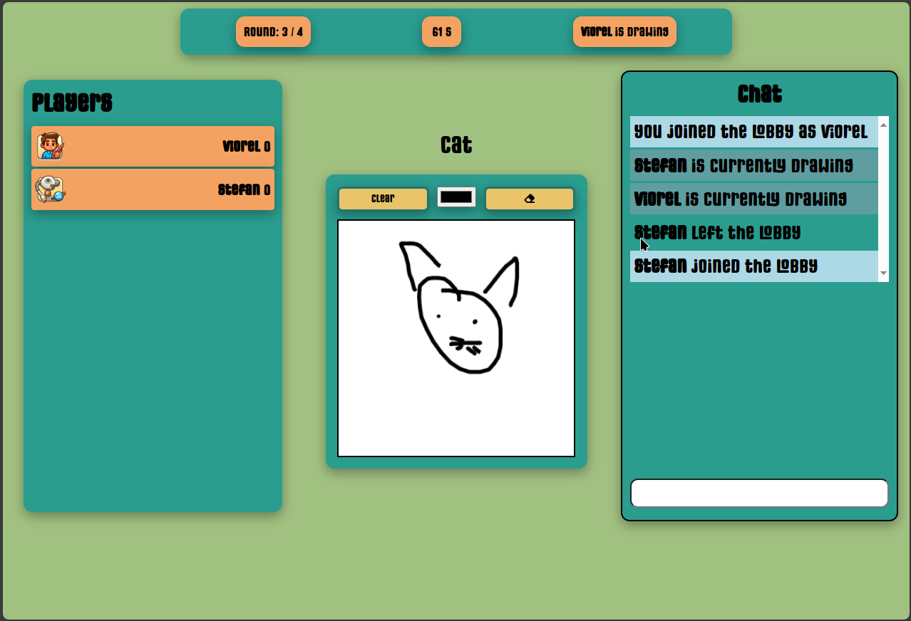

# Web Guess the Sketch Game

## Description

This project is a web-based game where players guess the sketch being drawn by other players in real-time. It includes features for drawing, guessing, and chat functionality, making it a fun and interactive game for multiple users.



## Features

- Real-time drawing and guessing
- Chat functionality
- Score tracking
- User authentication

## Technologies

- Node.js
- Express.js
- Socket.io
- EJS
- CSS

## Installation

1. Clone the repository:
   ```bash
   git clone https://github.com/stefanFortza/Guess-The-Sketch.git
   ```
2. Navigate to the project directory:
   ```bash
   cd Guess-The-Sketch
   ```
3. Install the dependencies:
   ```bash
   npm install
   ```

## Usage

1. Start the application:
   ```bash
   npm start
   ```
2. Open your web browser and go to `http://localhost:5000`.
